# ArMoney  -  System and Agent Team Architecture

> The main project map. Source audit on **2026-10-05**, based on main
> `3e2aaa4962c16815b5f977d91a7eafe9b7c060ce` plus this ledger-replication change.
> Describes the source code, not the guaranteed state of running containers.

## Navigation

1. [Readiness and stack](#readiness-and-stack)
2. [Services and runtime](#services-and-runtime)
3. [API and authentication](#api-and-authentication)
4. [Data and ledger](#data-and-ledger)
5. [Phone P2P and notifications](#phone-p2p-and-notifications)
6. [Agent team](#agent-team)
7. [Communication and remediation](#communication-and-remediation)
8. [Verification and delivery](#verification-and-delivery)
9. [Keeping documentation current](#keeping-documentation-current)

## Readiness and stack

A banking backend with service boundaries for identity, profiles, wallets, payments, and ledger accounting.
**M1 is the first functional milestone:** authorized public P2P, durable recovery,
phone recipient confirmation, and a native client. Completion requires passing
exact-revision CI and independent review; source implementation is not deployment evidence.

| Area | Current state | Next steps |
| --- | --- | --- |
| Auth | Password login and Keycloak exchange, stable local identities, opaque sessions | Global provider logout/revocation integration |
| SSO | Optional Keycloak realm, browser authorization code + PKCE | Production identity controls, MFA, email verification |
| iOS | Existing native SwiftUI login, wallets/balances, transfers/history, notifications and profile (iOS 18+); feature development paused | Physical iPhone validation paused; regression CI retained |
| Android | Native Kotlin/Compose SSO, wallets/balances, phone transfers/history, inbox and profile (API26+) | Physical-device/LAN acceptance; exact-revision CI evidence in the delivery PR |
| User | Profile, pending phone, operator-attested phone directory | Automated ownership proof requires a separate approved provider |
| Wallet | Metadata, durable ledger provisioning, owner-scoped live balances | Lifecycle controls |
| Ledger | Private accounts, balances, atomic postings; optional two direct physical standbys and fenced balance reads | Manual failover; production HA and backup/PITR |
| Payment | Durable P2P, requester idempotency, recovery, history and notifications | Pagination and operational reconciliation tooling |
| Gateway | Auth, profile/phone, wallets/balances, P2P and notifications | Further hardening |

Java 21, Gradle multi-project, Javalin, PostgreSQL, Flyway, jOOQ, HikariCP;
Spock, Testcontainers, ArchUnit; REST/OpenAPI; Docker Compose, GitHub Actions.
Exact versions: [build.gradle](build.gradle), [runtime build](platform-runtime/build.gradle),
[Gradle wrapper](gradle/wrapper/gradle-wrapper.properties), [Compose](compose.yaml).
Spring, Kafka, Redis and Kubernetes are not implemented. Native iOS uses SwiftUI; Android uses Kotlin and Jetpack Compose;
Keycloak and Caddy are optional container services, configured by compose.sso.yaml.

## Services and runtime

**Base backend connections are shown below; the optional native-client SSO edge is described separately.** Wallet provisions accounts through the
private ledger API. Payment validates user/wallet mappings and posts through ledger.

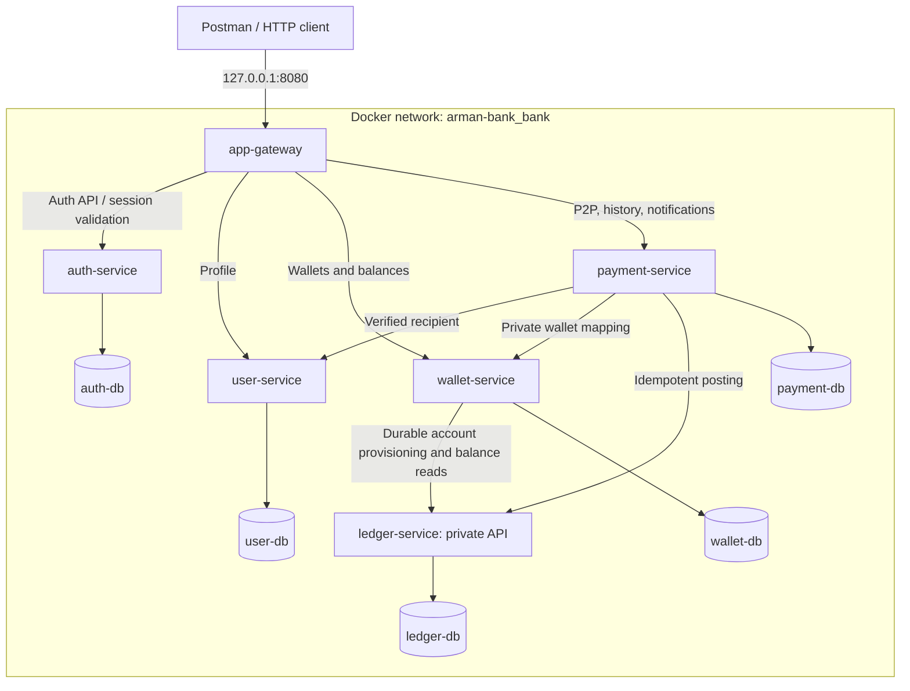

| Module | Responsibility | Boundary |
| --- | --- | --- |
| app-gateway | External routes, session validation, header sanitization | No database or financial logic |
| auth-service | Credentials, SSO identity mapping, sessions, limits | Does not own profiles |
| user-service | Profile and operator-attested phone directory | Does not issue tokens or claim SMS proof |
| wallet-service | Owner, currency, lifecycle and durable ledger mapping | Not the source of balances |
| payment-service | Transfer intent, client idempotency, recovery and notifications | Completion requires matching ledger confirmation |
| ledger-service | Accounts, balances, immutable paired postings | No public funding API |
| platform-runtime | HTTP lifecycle, DB wiring, migrations, health | A library, not a separate service; no shared business entities |

### Code boundaries

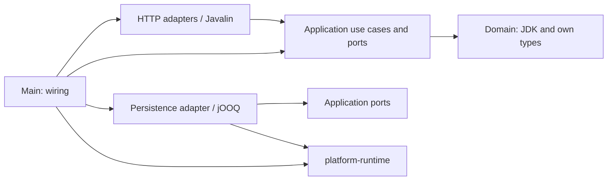

This is a rule for organizing use cases, not a claim that every scaffold contains all
layers. Ports are introduced for real dependencies. Services do not import each other's
Java code or read each other's databases. ArchUnit checks architectural constraints.

### Containers and local environment

Java container startup adds `infra/runtime/java-security.properties` to the JDK
security defaults. Positive, negative and stale JVM DNS caches are disabled for
dynamic Compose service names: restarted containers may exchange IP addresses.
The setting is container-scoped and does not replace the JDK security policy.

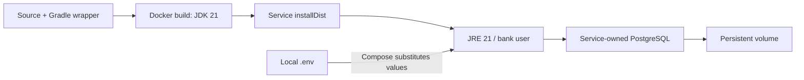

Inside Compose, services listen on 8080 and PostgreSQL on 5432. Base Compose publishes
only the gateway on loopback; the five databases have separate volumes. Flyway runs
while DB wiring is created, before the HTTP listener opens. Migration failure prevents startup.

Variables: `PORT`, `DB_URL`, `DB_USER`, `DB_PASSWORD`; protected internal APIs use
`INTERNAL_AUTH_KEY`; the gateway uses `AUTH_BASE_URL`, `USER_BASE_URL`, `WALLET_BASE_URL`, `PAYMENT_BASE_URL`.
Payment uses `USER_BASE_URL`, `WALLET_BASE_URL`, `LEDGER_BASE_URL`.
Secrets come from local configuration; their values must not appear in documentation.
A regular Java launch **does not read `.env` automatically**: configure environment
variables/an env file in IDEA; Compose uses its own substitution mechanism.

The user's local `compose.override.yaml` exposes databases to DataGrip on
`127.0.0.1`: auth **5433**, user **5434**, wallet **5435**, payment **5436**, ledger
**5437**. This is not guaranteed configuration for a fresh clone: check your own
override. All database containers use `bank` as the database and user name; the password is local.
Restarting does not require deleting volumes. See [README](README.md) and [IDEA](docs/onboarding.md).

## Native clients and SSO

The optional overlay adds an HTTPS edge and a Keycloak-owned PostgreSQL database.
Caddy supplies default SNI from ARMONEY_HOST for clients using numeric IP origins; certificate name and CA validation still apply. Only the edge is bound to the selected LAN interface; the existing gateway binding
remains loopback. Keycloak administration and management paths are not exposed on
the LAN listener. An optional workstation-only override exposes the admin console
through Caddy at `https://localhost:9443`, bound to `127.0.0.1`; it uses a separate
admin hostname and master-realm frontend URL, preserving the ArMoney issuer.
See [local administration](docs/sso-and-ios.md#optional-host-only-administration).

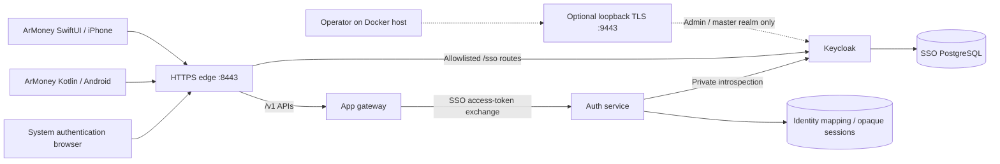

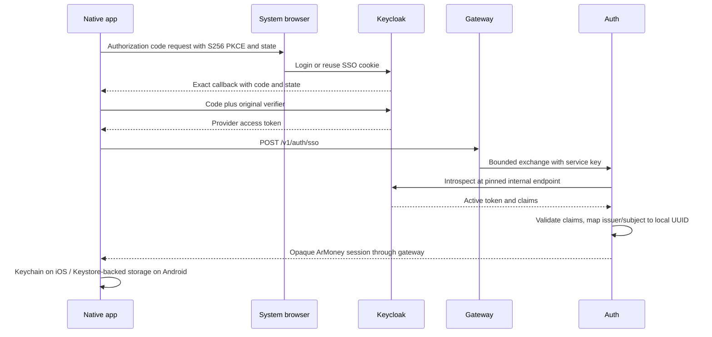

No identity is linked by email. Existing password identities and their wallet UUIDs
remain unchanged; SSO-only /auth/me responses have email=null. The client consumes
no ID-token claims or refresh tokens. Local sessions expire after 30 minutes;
provider logout/disablement does not immediately revoke issued local sessions.
Local logout and browser logout are separate operations, not global single logout.
The app supports profile onboarding and actual wallet PENDING/READY states, with
no fabricated balances or transfer success. TLS trust must be configured on each
Mac/iPhone/Android device; native code never bypasses certificate validation. See
[setup](docs/sso-and-ios.md), [iOS](ios/README.md) and [ADR 0008](docs/adr/0008-native-ios-and-keycloak-sso.md).

Android build/configuration and acceptance are described in [android/README.md](android/README.md),
[Android contract](docs/android-contract.md) and [ADR 0010](docs/adr/0010-native-android.md).
The Android public client uses its own exact callback; both native clients map the
same issuer/subject to one bank identity. No new financial service is introduced.

## API and authentication

Contracts are in each service's `src/main/resources/openapi.yaml`.
`/openapi.yaml` serves YAML, not Swagger UI. `/` is not a user interface.

| Access | Method and path | Purpose |
| --- | --- | --- |
| Gateway | POST `/v1/auth/register`, POST `/v1/auth/login` | Registration / session |
| Gateway | POST `/v1/auth/sso` | Provider-token exchange; requires optional SSO configuration |
| Gateway + Bearer | GET `/v1/auth/me`, POST `/v1/auth/logout` | Identity / revocation |
| Gateway + Bearer | GET / PUT `/v1/users/me` | Own profile |
| Gateway + Bearer | GET / POST `/v1/wallets`, GET `/v1/wallets/{id}/balance` | Own wallets and live balances |
| Gateway + Bearer | PUT `/v1/users/me/phone`, POST `/v1/recipients/resolve` | Pending phone and exact verified recipient lookup |
| Gateway + Bearer | POST / GET `/v1/payments`, GET `/v1/payments/{id}` | Idempotent transfers and participant history |
| Gateway + Bearer | GET `/v1/notifications`, POST `/v1/notifications/{id}/read` | Own in-app inbox |
| Private ledger | POST `/v1/ledger/accounts`, GET `/v1/ledger/accounts/{id}` | Account and balance |
| Private ledger | POST `/v1/ledger/transfers`, GET `/v1/ledger/transfers/{id}` | Posting/replay and outcome |
| Each service | GET `/health/live`, `/health/ready`, `/openapi.yaml` | Operational endpoints |

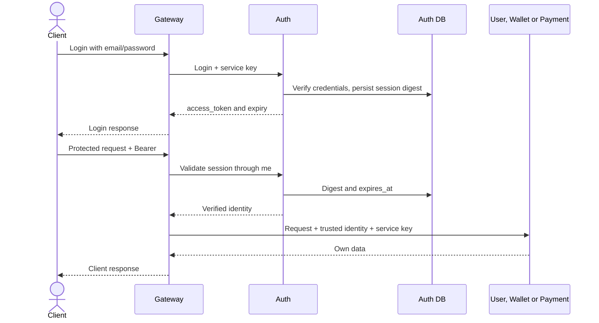

Passwords are protected with Argon2id. The token is a random opaque string, not a JWT;
`sessions` stores its SHA-256 digest. Sessions last 30 minutes; logout deletes the session.
The gateway validates every protected business request through auth, replaces the client's
identity with the trusted identity, and does not forward the bearer token to user/wallet/payment.
Authorization failure blocks the request.

Ledger requires `X-Service-Key` and a trusted `X-Identity-Id`; the gateway does not proxy it.
The shared service key does not isolate compromised services from one another.
A persistent service's readiness checks only its own database; gateway readiness checks
only the gateway itself. `UP` does not prove downstream availability or P2P correctness.

## Data and ledger

UUIDs shared across services are **logical references**, not cross-database foreign keys.
`owner_id` means the auth identity UUID, not the profile ID.

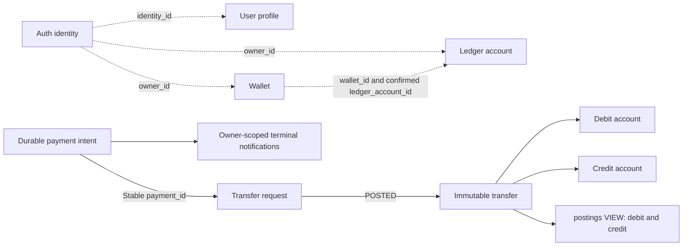

| Database | Tables / guarantees |
| --- | --- |
| auth-db | `identities`: nullable email/password_hash pair for SSO-only principals, unique non-null email; `external_identities`: (issuer, subject) PK and unique local identity mapping; `sessions`: token_hash PK, FK identity_id, expires_at; `auth_attempts`: persistent limits |
| user-db | `profiles`: unique identity_id, display_name, pending/verified E.164 phone; unique verified number; operator audit and persistent lookup quota |
| wallet-db | `wallets`: unique(owner_id,currency), AED, ACTIVE/CLOSED, PENDING/READY, unique ledger_account_id, durable retry lease; no balance |
| payment-db | `payments`: unique(requester_id,idempotency_key), request_hash, wallet IDs, amount/currency, PENDING/COMPLETED/REJECTED, recipient/account snapshot, fenced lease/backoff; notifications unique(owner,payment,type) |
| ledger-db | `accounts`: unique wallet_id, owner, CUSTOMER/CLEARING, balance_minor; `transfers`: payment_id PK and account/currency FKs; `transfer_requests`: durable payload/outcome; `postings`: view |
| Every database | `flyway_schema_history`: technical record of applied migrations |

Accounts referenced in transfer_requests do not have to exist: this table also preserves
rejections. `accounts.wallet_id` is not yet validated through an HTTP request to wallet-service.
Exact columns, indexes, and constraints are defined in service migrations; published
migrations are append-only. The current DB owner has administrative capabilities:
triggers do not protect against an administrator. A restricted runtime DB role is future work.

### Optional ledger replicas

`compose.ledger-replication.yaml` preserves `ledger-db` and adds two direct
PostgreSQL physical hot standbys. Application commits require WAL flush on at
least one synchronous standby. Only account/balance reads can use replica pools:
each query checks database/cluster/timeline/recovery identity and a primary WAL
replay fence, then falls back to primary when unavailable or stale. Provisioning,
posting and durable result lookup stay primary. Replicas never run Flyway.

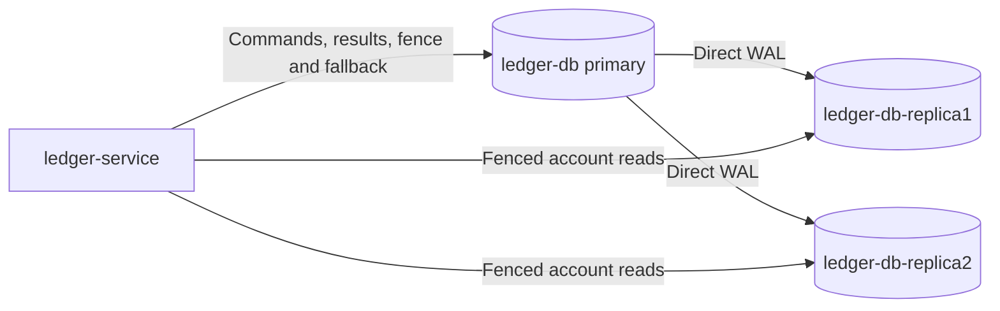

Read routing requires primary availability; it does not provide automatic outage
reads. With both synchronous replicas unavailable, commit acknowledgement waits;
timeouts retain uncertain command semantics. Promotion, fencing, reparenting and
application pool reconfiguration are manual. No HA manager, failover proxy or
production backup/PITR is introduced. Containers sharing one host are not independent
host failure domains. See [ADR 0013](docs/adr/0013-ledger-replication.md) and
[operations and disposable acceptance](docs/ledger-replication.md).

### Atomic posting  -  implemented

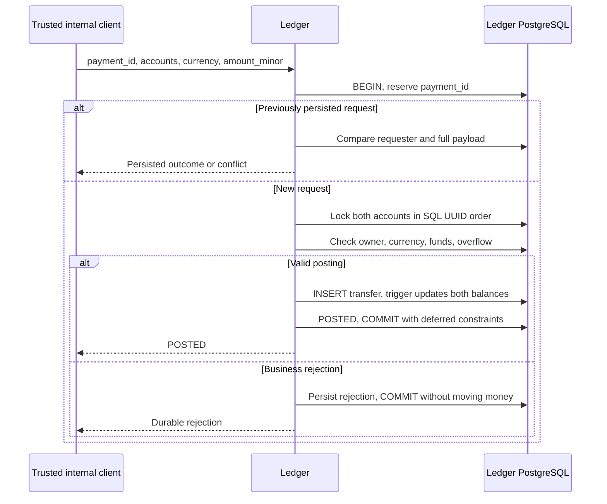

AED is the only supported currency. Money is represented as integer fils: `100` equals
1 AED. Wallet creation, payments and ledger posting reject other currencies.
Append-only migrations enforce this rule and refuse non-AED historical data without
conversion; see [ADR 0011](docs/adr/0011-aed-only.md). The amount must be positive, CUSTOMER balances cannot be negative,
and overflow is prohibited. One immutable transfer produces two opposite entries in the
postings view. The posting, balances, and terminal result commit in one PostgreSQL transaction.
Deferred constraints prevent committing an unfinished PENDING request.

A retry uses the same `payment_id`, requester, and payload; a changed request produces
a conflict. A durable insufficient-funds rejection remains a rejection even after later
funding. After a timeout, retry or look up **the same ID**: no response does not mean rollback.
A transaction failure rolls back its changes.
POST: 200 POSTED, 409 rejection/conflict; outcome GET: 200 even for a persisted rejection,
404 for a missing result or one belonging to another requester. Accounts open with zero balance.
There is no funding API; CLEARING fixtures are used only in isolated tests.
Details: [ledger](docs/ledger.md), [ADR 0005](docs/adr/0005-atomic-ledger.md).

### Durable wallet provisioning  -  implemented

POST /v1/wallets commits intent and returns 202 for ACTIVE/PENDING, or 200 for READY
and existing CLOSED wallets. GET includes provisioning_status and nullable
ledger_account_id. ACTIVE alone is not readiness: payments require READY.
Wallet requires LEDGER_BASE_URL (Compose supplies http://ledger-service:8080).

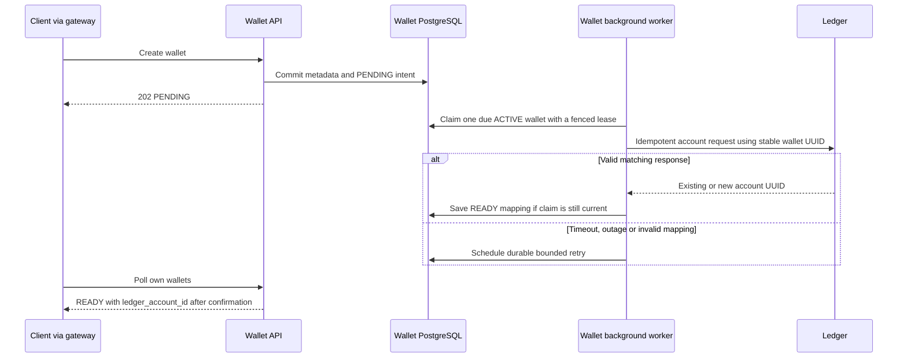

The worker processes up to ten sequential claims per tick with no transaction held
across HTTP. Each claim has a 30-second lease; stale workers are fenced by a token.
The scheduler ticks after a one-second fixed delay. Failed attempts back off through
2/4/8/16/32/60 seconds; pending work is retained, not silently abandoned. HTTP has
2-second connect, 5-second request and 6-second whole-response deadlines and a 4 KiB
response bound. Worker database operations use a 2-second lock timeout and a
5-second statement timeout. Shutdown waits up to 10 seconds for the worker before
closing resources. If it cannot stop, shutdown reports an explicit error and leaves
resources open until process termination; the durable lease permits recovery.

V3 initializes existing wallets as PENDING. Existing ACTIVE wallets reconcile;
CLOSED wallets are neither reopened nor claimed. An administrative close after a
claim cannot cancel an in-flight ledger call atomically and may leave an unmapped
zero-balance account; no public close endpoint exists. A ledger commit followed by a lost
response or wallet crash is recovered with the same wallet UUID. A valid replay may
return a nonzero ledger balance; wallet only owns the mapping. Mismatched owner,
wallet or currency never becomes READY. See [ADR 0007](docs/adr/0007-wallet-ledger-provisioning.md).

## Phone P2P and notifications

[HTTP contract](docs/p2p-contract.md) and [ADR 0009](docs/adr/0009-phone-p2p-payments.md)
cover the implemented boundary and local operator procedure.

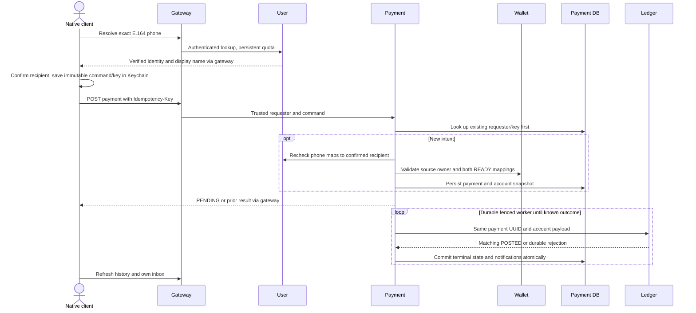

No shared distributed transaction is held across services. Ledger owns the money;
payment remains PENDING after timeout, malformed response or unavailable dependencies.
A crash after ledger commit is recovered by replaying the same ledger command. Terminal
notifications commit with payment state, with unique constraints preventing duplicates.
The recipient sees only completed incoming payments; the sender sees all its intents.
History and inbox return the latest 100 entries, without pagination in this version.

Phone updates are unverified until a local operator confirms ownership out of band
and runs the audited CLI. No SMS, push provider or other external service is connected.
Only verified numbers resolve; lookup is exact and limited to 30 attempts per requester
per 60 seconds, including misses. It reveals the matched display name, not email or a
user directory. Changing a number clears verification. Accepted payment snapshots are
not redirected by later phone changes. No public verification or funding endpoint exists.

The native clients expose wallets, transfers, notifications and profile. Amounts use
exact Int64/Long minor units. An uncertain command/key is retained in device-only
Keychain (iOS) or Keystore-backed encrypted storage (Android), scoped per origin and
identity across restart/logout; retry uses the same payload. Foreground/manual refresh
fetches in-app notifications; no background delivery or OS push is promised.
Existing scaffold payment rows without recipient/account mappings are not executed or
exposed. See [M1](docs/m1.md) for acceptance and remaining scope.

## Agent team

Agents run for specific tasks inside Codex; they are not bank containers or permanent
background processes. The main chat acts as the orchestrator. Up to three workers run
concurrently; other roles run in waves, and only roles needed for the task are activated.
Models/permissions are inherited from the session; instructions are not a security sandbox.

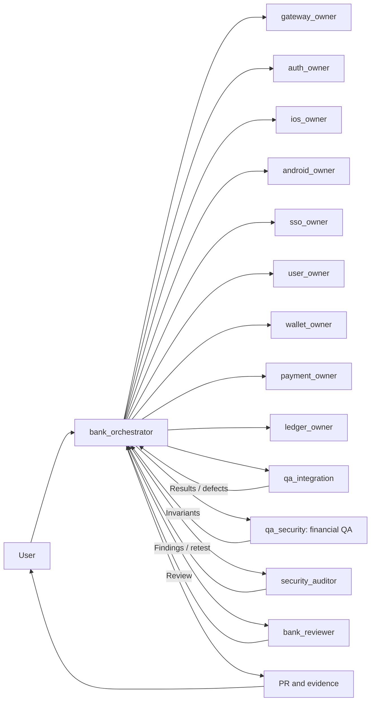

| Agent | Responsibility / writable scope |
| --- | --- |
| bank_orchestrator | Assignment, integration, shared config/runtime, Compose/CI, this documentation, PR |
| gateway_owner | app-gateway: routes, public contract, identity |
| auth_owner | auth-service: credentials, sessions, limits |
| android_owner | android: native Kotlin/Compose client, browser SSO, gateway contracts and secure recovery |
| ios_owner | ios: native SwiftUI client, gateway integration, browser authentication and tests |
| sso_owner | sso-service: Keycloak/OIDC configuration; auth SSO adapter files only under an explicitly transferred lease |
| user_owner | user-service: profiles, phone directory and operator attestation |
| wallet_owner | wallet-service: metadata/lifecycle, durable provisioning and live balances |
| payment_owner | payment-service: orchestration/idempotency, recovery and notifications |
| ledger_owner | ledger-service: accounts, balances, posting correctness |
| qa_integration | End-to-end contracts, outages/recovery; only assigned test files |
| qa_security | Financial invariants and owner isolation; only assigned tests |
| security_auditor | System security, trust, secrets, dependencies, Docker/CI; independent retesting |
| bank_reviewer | Independent review of the integrated result; read-only |

Owners also maintain module tests and OpenAPI. QA/security are read-only until specific
test files are assigned. Each file has one writer; builds in a shared directory run
serially. The orchestrator manages shared Docker within the authorized task scope.

Roles: `.codex/agents`; skills: `.agents/skills`.

| Skill | Purpose |
| --- | --- |
| bank-java | Java 21, Gradle, layer boundaries, and resources |
| bank-postgres | jOOQ/HikariCP, Flyway, transactions/locks/retries |
| bank-api | OpenAPI, Javalin, identity, bounded HTTP |
| bank-android | Native Kotlin client, browser PKCE, Keystore persistence and emulator evidence |
| bank-ios | Native SwiftUI iOS 18+, gateway integration, Keychain and device validation |
| bank-sso | Keycloak OIDC, authorization code/PKCE, identity mapping and session migration |
| bank-testing | Spock, Testcontainers, ArchUnit, evidence |
| bank-financial-correctness | Postings, balances, concurrency, idempotency |
| bank-security | Security review and fix verification |
| bank-coordination | Assignments, messages, finding IDs, checkpoints |

Details: [skills matrix](docs/agents/skills.md), [workflow](docs/agents/workflow.md),
[team ADR](docs/adr/0006-agent-team.md). If automatic loading is unavailable, the role/skill
is read explicitly and passed into a scoped assignment; the fallback is disclosed to the user.

## Communication and remediation

Shared files do not imply shared conversation context. Saving Markdown does not notify
anyone by itself; the orchestrator forwards concrete assignments and evidence.

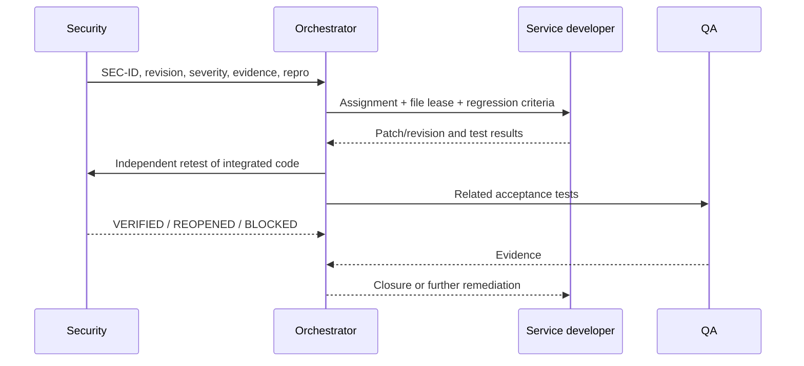

Use `send_message` for a running agent and `followup_task`, or the current client's
equivalent, for an agent that has finished. An unavailable agent is replaced with a new
one carrying the same IDs and context. On session resumption, assignments are restored
from the checkpoint and checked against source code/CI. These are orchestrator actions,
not a background task queue.

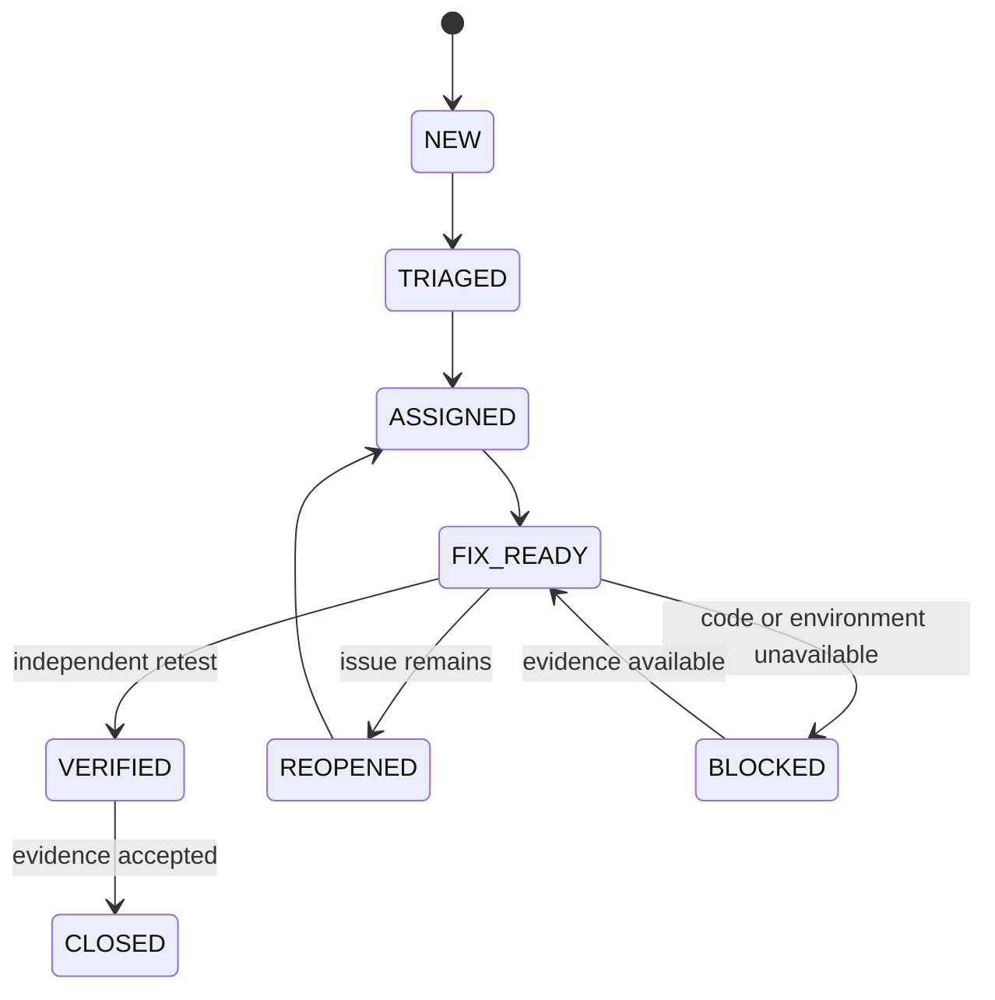

BLOCKED is possible at other stages, preserving the previous status and the reason.
False positives are closed with evidence and independent review. Confirmed unresolved
critical/high findings block PR readiness; green CI or the word "fixed" does not close
a finding. Accepting residual risk and merging are user decisions.
Records/checkpoints: [protocol](docs/agents/communication.md).

## Verification and delivery

All new PRs target `main`, which contains the integrated backend and native iOS/SSO
slices. Feature branches start from the latest main unless the user specifies
otherwise; the former bootstrap branch is no longer the default integration target. No direct pushes
to main or automatic merges.

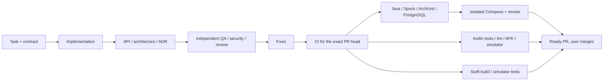

| Check | What it establishes |
| --- | --- |
| `./gradlew test` | Unit/architecture checks; excludes IntegrationSpec |
| `./gradlew check` | Also runs real PostgreSQL Testcontainers; requires Docker |
| `./gradlew installDist` | Runnable distributions |
| `scripts/smoke.py` | Readiness of six services, not business correctness |
| Auth/onboarding smoke in CI | Auth, profile, wallets through HTTP |
| Provisioning smoke in CI | Concurrent retries, ledger outage, wallet restart and unique zero-balance account mapping |
| Ledger smoke in CI | Private posting with synthetic funds |
| `scripts/p2p-smoke.py` in disposable CI | Phone resolution, public P2P, duplicate/concurrent spending, outages, post-commit recovery, notification isolation and journal reconciliation |
| Android CI | Debug APK, lint, JVM tests and real Keystore/native screen emulator tests |
| SSO browser smoke in CI | Disposable Keycloak authorization code/PKCE and gateway exchange for iOS and Android |
| macOS iOS CI | Native compilation and simulator unit tests; not physical-device acceptance |

On Windows, use `.\gradlew.bat`. CI: [.github/workflows/ci.yml](.github/workflows/ci.yml).
Fixture funding and `down --volumes` are only for disposable CI environments, never user
databases. Smoke scripts currently expect port 8080 and the `arman-bank_bank` network;
a different Compose project name alone does not provide an isolated parallel test.

## Keeping documentation current

**Document owner: bank_orchestrator.** Every change is assessed for documentation impact.
Service owners report changes to APIs, schemas, connections, invariants, and limitations
in their handoffs. The orchestrator updates this file and related documents **in the same PR**;
bank_reviewer checks them against the integrated code.

| Change | Documentation to review |
| --- | --- |
| Service / HTTP dependency | Service map, responsibilities, sequence diagrams |
| API / auth | API table, OpenAPI, trust model |
| Migration / consistency | Data, ledger flow, ADR |
| Compose / env / ports | Runtime and instructions, without secrets |
| Agent / skill / communication | Team, skills matrix, protocol, role files |
| CI / tests / readiness | Checks, limitations, M1 plan |

If documented behavior is unchanged, the PR explains why documentation is unaffected
instead of making a cosmetic date change. A substantive update records the date and
verified source revision. Planned behavior must not be presented as implemented, and
completed features must not remain only in the future section. ADRs preserve history;
a new decision gets a new ADR. The independent reviewer treats documentation drift as a defect.

This is a rule for every task and review, **not a background update while Codex is closed**.
External changes are reconciled the next time work resumes on the repository. The rule
is established in [AGENTS.md](AGENTS.md), role instructions, and the PR template.
Further reading: [README](README.md), [IDEA and manual testing](docs/onboarding.md),
[ledger](docs/ledger.md), [M1](docs/m1.md), [ADRs](docs/adr/0001-bootstrap.md).

### Context-efficient agent routing

Dedicated ios_owner, android_owner and sso_owner roles own native clients and SSO.
They load bank-ios, bank-android and bank-sso skills only for relevant tasks. Shared instructions
remain in AGENTS.md/workflow; [context-map](docs/agents/context-map.md) points to
contracts on demand. [Audit](docs/agents/context-efficiency.md) records measured
text reductions, not estimated billing savings. Fresh scoped worker contexts and
bounded evidence replace full-history copies for independent tasks. macOS CI
compiles/tests Swift; disposable browser CI verifies Keycloak code/PKCE and SSO.
