# Arman Bank — System and Agent Team Architecture

> The main project map. Checked against source code on **2026-09-30**, source revision
> `760ab2e011aec23a2d2e69d4ebdcf27a9a143365` on `main`, plus the wallet provisioning changes in this PR.
> Describes the source code, not the guaranteed state of running containers.

## Navigation

1. [Readiness and stack](#readiness-and-stack)
2. [Services and runtime](#services-and-runtime)
3. [API and authentication](#api-and-authentication)
4. [Data and ledger](#data-and-ledger)
5. [Planned P2P](#planned-p2p)
6. [Agent team](#agent-team)
7. [Communication and remediation](#communication-and-remediation)
8. [Verification and delivery](#verification-and-delivery)
9. [Keeping documentation current](#keeping-documentation-current)

## Readiness and stack

A banking backend with service boundaries for identity, profiles, wallets, payments, and ledger accounting.
**M1 is the first functional milestone and is not complete yet:** public P2P transfers
must behave correctly under retries, concurrency, and failures. The private ledger
alone does not complete M1.

| Area | Current state | Next steps |
| --- | --- | --- |
| Auth | Register/login/me/logout, opaque sessions | Production identity controls, MFA, email verification |
| User | Profile for the current identity | Further development as requirements emerge |
| Wallet | Metadata, ACTIVE/CLOSED, durable PENDING/READY ledger provisioning | Payment integration |
| Ledger | Private accounts, balances, atomic postings, wallet integration | Payment integration |
| Payment | Schema and operational endpoints | P2P orchestration and PENDING recovery |
| Gateway | Auth, profile, wallets | Public P2P endpoints |

Java 21, Gradle multi-project, Javalin, PostgreSQL, Flyway, jOOQ, HikariCP;
Spock, Testcontainers, ArchUnit; REST/OpenAPI; Docker Compose, GitHub Actions.
Exact versions: [build.gradle](build.gradle), [runtime build](platform-runtime/build.gradle),
[Gradle wrapper](gradle/wrapper/gradle-wrapper.properties), [Compose](compose.yaml).
Spring, Kafka, Redis, Kubernetes, and iOS are not implemented.

## Services and runtime

**Only existing HTTP connections are shown.** Wallet provisions accounts through the
private ledger API. Payment does not call ledger yet.

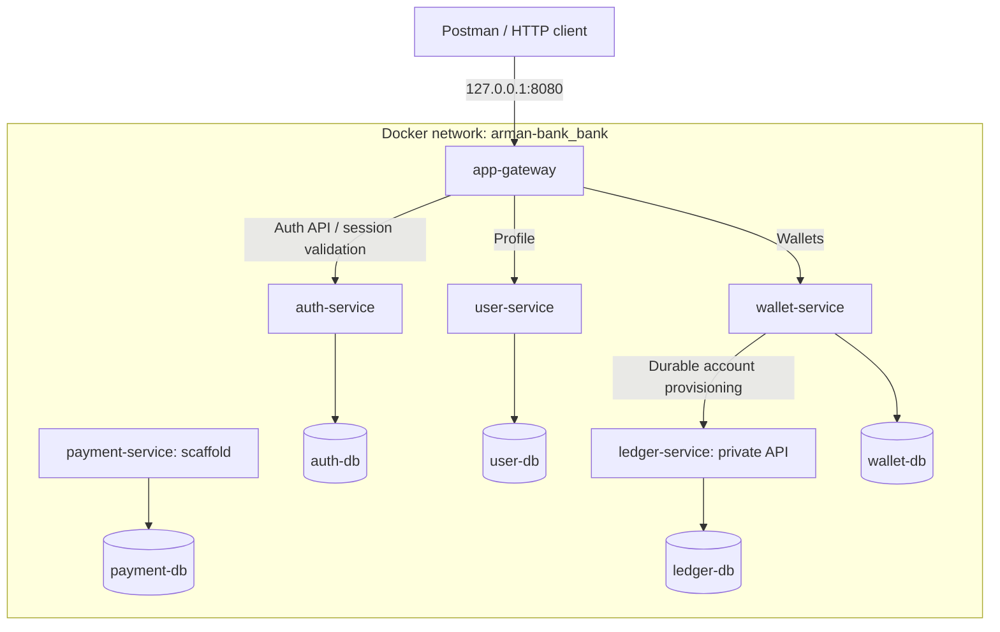

| Module | Responsibility | Boundary |
| --- | --- | --- |
| app-gateway | External routes, session validation, header sanitization | No database or financial logic |
| auth-service | Credentials, sessions, limits | Does not own profiles |
| user-service | Profile for an auth identity | Does not issue tokens |
| wallet-service | Owner, currency, lifecycle and durable ledger mapping | Not the source of balances |
| payment-service | Planned transfer workflow/client idempotency | Business operations are not implemented yet |
| ledger-service | Accounts, balances, immutable paired postings | No public funding API |
| platform-runtime | HTTP lifecycle, DB wiring, migrations, health | A library, not a separate service; no shared business entities |

### Code boundaries

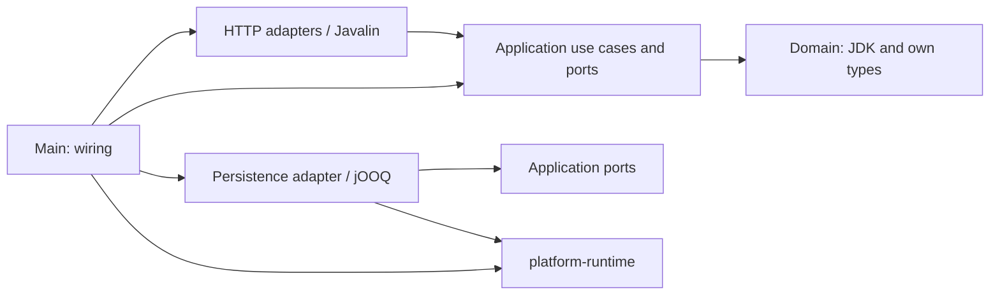

This is a rule for organizing use cases, not a claim that every scaffold contains all
layers. Ports are introduced for real dependencies. Services do not import each other's
Java code or read each other's databases. ArchUnit checks architectural constraints.

### Containers and local environment

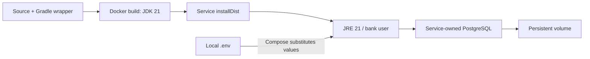

Inside Compose, services listen on 8080 and PostgreSQL on 5432. Base Compose publishes
only the gateway on loopback; the five databases have separate volumes. Flyway runs
while DB wiring is created, before the HTTP listener opens. Migration failure prevents startup.

Variables: `PORT`, `DB_URL`, `DB_USER`, `DB_PASSWORD`; protected internal APIs use
`INTERNAL_AUTH_KEY`; the gateway uses `AUTH_BASE_URL`, `USER_BASE_URL`, `WALLET_BASE_URL`.
Secrets come from local configuration; their values must not appear in documentation.
A regular Java launch **does not read `.env` automatically**: configure environment
variables/an env file in IDEA; Compose uses its own substitution mechanism.

The user's local `compose.override.yaml` exposes databases to DataGrip on
`127.0.0.1`: auth **5433**, user **5434**, wallet **5435**, payment **5436**, ledger
**5437**. This is not guaranteed configuration for a fresh clone: check your own
override. All database containers use `bank` as the database and user name; the password is local.
Restarting does not require deleting volumes. See [README](README.md) and [IDEA](docs/onboarding.md).

## API and authentication

Contracts are in each service's `src/main/resources/openapi.yaml`.
`/openapi.yaml` serves YAML, not Swagger UI. `/` is not a user interface.

| Access | Method and path | Purpose |
| --- | --- | --- |
| Gateway | POST `/v1/auth/register`, POST `/v1/auth/login` | Registration / session |
| Gateway + Bearer | GET `/v1/auth/me`, POST `/v1/auth/logout` | Identity / revocation |
| Gateway + Bearer | GET / PUT `/v1/users/me` | Own profile |
| Gateway + Bearer | GET / POST `/v1/wallets` | Own wallets |
| Private ledger | POST `/v1/ledger/accounts`, GET `/v1/ledger/accounts/{id}` | Account and balance |
| Private ledger | POST `/v1/ledger/transfers`, GET `/v1/ledger/transfers/{id}` | Posting/replay and outcome |
| Each service | GET `/health/live`, `/health/ready`, `/openapi.yaml` | Operational endpoints |

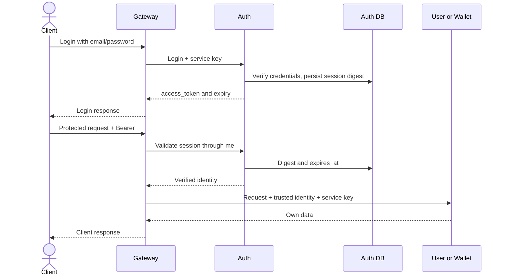

Passwords are protected with Argon2id. The token is a random opaque string, not a JWT;
`sessions` stores its SHA-256 digest. Sessions last 30 minutes; logout deletes the session.
The gateway validates every profile/wallet request through auth, replaces the client's
identity with the trusted identity, and does not forward the bearer token to user/wallet.
Authorization failure blocks the request.

Ledger requires `X-Service-Key` and a trusted `X-Identity-Id`; the gateway does not proxy it.
The shared service key does not isolate compromised services from one another.
A persistent service's readiness checks only its own database; gateway readiness checks
only the gateway itself. `UP` does not prove downstream availability or P2P correctness.

## Data and ledger

UUIDs shared across services are **logical references**, not cross-database foreign keys.
`owner_id` means the auth identity UUID, not the profile ID.

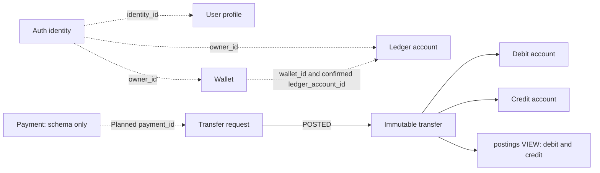

| Database | Tables / guarantees |
| --- | --- |
| auth-db | `identities`: unique email, password_hash; `sessions`: token_hash PK, FK identity_id, expires_at; `auth_attempts`: persistent limits |
| user-db | `profiles`: unique identity_id, display_name |
| wallet-db | `wallets`: unique(owner_id,currency), EUR/USD/GBP, ACTIVE/CLOSED, PENDING/READY, unique ledger_account_id, durable retry lease; no balance |
| payment-db | `payments`: unique(requester_id,idempotency_key), request_hash, wallet IDs, amount/currency, PENDING/COMPLETED/REJECTED; schema only |
| ledger-db | `accounts`: unique wallet_id, owner, CUSTOMER/CLEARING, balance_minor; `transfers`: payment_id PK and account/currency FKs; `transfer_requests`: durable payload/outcome; `postings`: view |
| Every database | `flyway_schema_history`: technical record of applied migrations |

Accounts referenced in transfer_requests do not have to exist: this table also preserves
rejections. `accounts.wallet_id` is not yet validated through an HTTP request to wallet-service.
Exact columns, indexes, and constraints are defined in service migrations; published
migrations are append-only. The current DB owner has administrative capabilities:
triggers do not protect against an administrator. A restricted runtime DB role is future work.

### Atomic posting — implemented

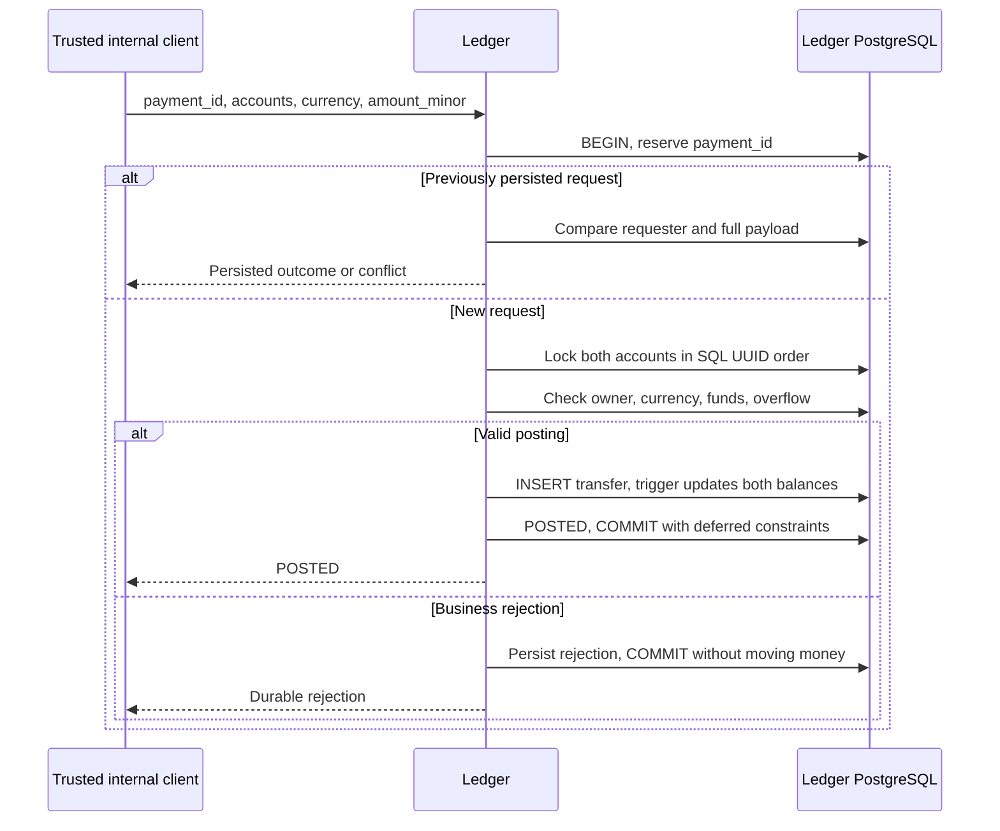

Money is represented as integer minor units and a currency: for EUR/USD/GBP, `100` equals
one currency unit. The amount must be positive, CUSTOMER balances cannot be negative,
and overflow is prohibited. One immutable transfer produces two opposite entries in the
postings view. The posting, balances, and terminal result commit in one PostgreSQL transaction.
Deferred constraints prevent committing an unfinished PENDING request.

A retry uses the same `payment_id`, requester, and payload; a changed request produces
a conflict. A durable insufficient-funds rejection remains a rejection even after later
funding. After a timeout, retry or look up **the same ID**: no response does not mean rollback.
A transaction failure rolls back its changes.
POST: 200 POSTED, 409 rejection/conflict; outcome GET: 200 even for a persisted rejection,
404 for a missing result or one belonging to another requester. Accounts open with zero balance.
There is no funding API; CLEARING fixtures are used only in isolated tests.
Details: [ledger](docs/ledger.md), [ADR 0005](docs/adr/0005-atomic-ledger.md).

### Durable wallet provisioning — implemented

POST /v1/wallets commits intent and returns 202 for ACTIVE/PENDING, or 200 for READY
and existing CLOSED wallets. GET includes provisioning_status and nullable
ledger_account_id. ACTIVE alone is not readiness: future payments require READY.
Wallet requires LEDGER_BASE_URL (Compose supplies http://ledger-service:8080).

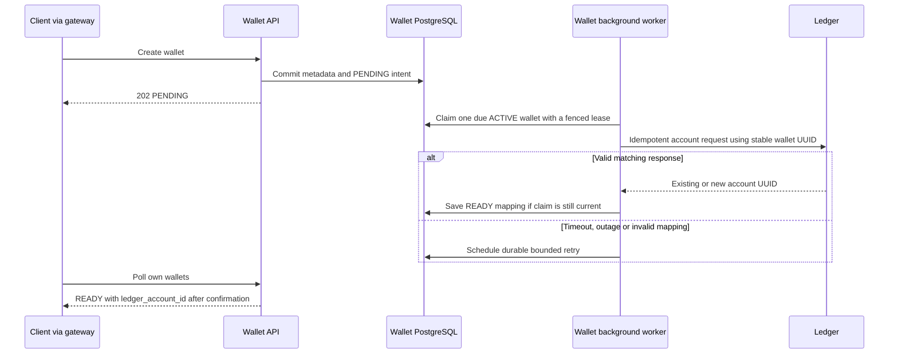

The worker processes up to ten sequential claims per tick with no transaction held
across HTTP. Each claim has a 30-second lease; stale workers are fenced by a token.
The scheduler ticks after a one-second fixed delay. Failed attempts back off through
2/4/8/16/32/60 seconds; pending work is retained, not silently abandoned. HTTP has
2-second connect, 5-second request and 6-second whole-response deadlines and a 4 KiB
response bound. Worker database operations use a 2-second lock timeout and a
5-second statement timeout. Shutdown waits up to 10 seconds for the worker before
closing resources. If it cannot stop, shutdown reports an explicit error and leaves
resources open until process termination; the durable lease permits recovery.

V3 initializes existing wallets as PENDING. Existing ACTIVE wallets reconcile;
CLOSED wallets are neither reopened nor claimed. An administrative close after a
claim cannot cancel an in-flight ledger call atomically and may leave an unmapped
zero-balance account; no public close endpoint exists. A ledger commit followed by a lost
response or wallet crash is recovered with the same wallet UUID. A valid replay may
return a nonzero ledger balance; wallet only owns the mapping. Mismatched owner,
wallet or currency never becomes READY. See [ADR 0007](docs/adr/0007-wallet-ledger-provisioning.md).

## Planned P2P

**A plan, not an implemented flow.** Dashed connections remain to be built.

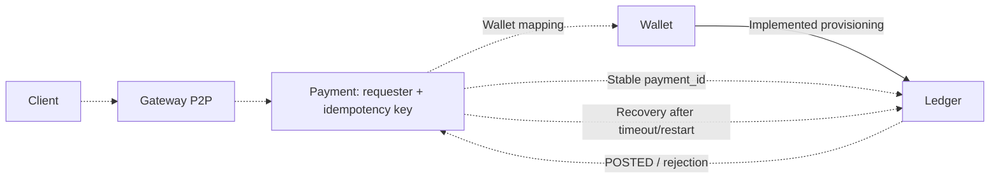

Wallet-to-ledger provisioning and recovery are implemented. Next: payment orchestration,
reconciliation and public P2P with full acceptance tests. An `ACTIVE` wallet alone
does not establish ledger readiness. There is no shared distributed transaction:
durable state and idempotent commands are needed, not a promise of exactly-once HTTP.
See [M1](docs/m1.md) and the [provisioning mission](docs/agents/missions/wallet-ledger.md).

## Agent team

Agents run for specific tasks inside Codex; they are not bank containers or permanent
background processes. The main chat acts as the orchestrator. Up to three workers run
concurrently; other roles run in waves, and only roles needed for the task are activated.
Models/permissions are inherited from the session; instructions are not a security sandbox.

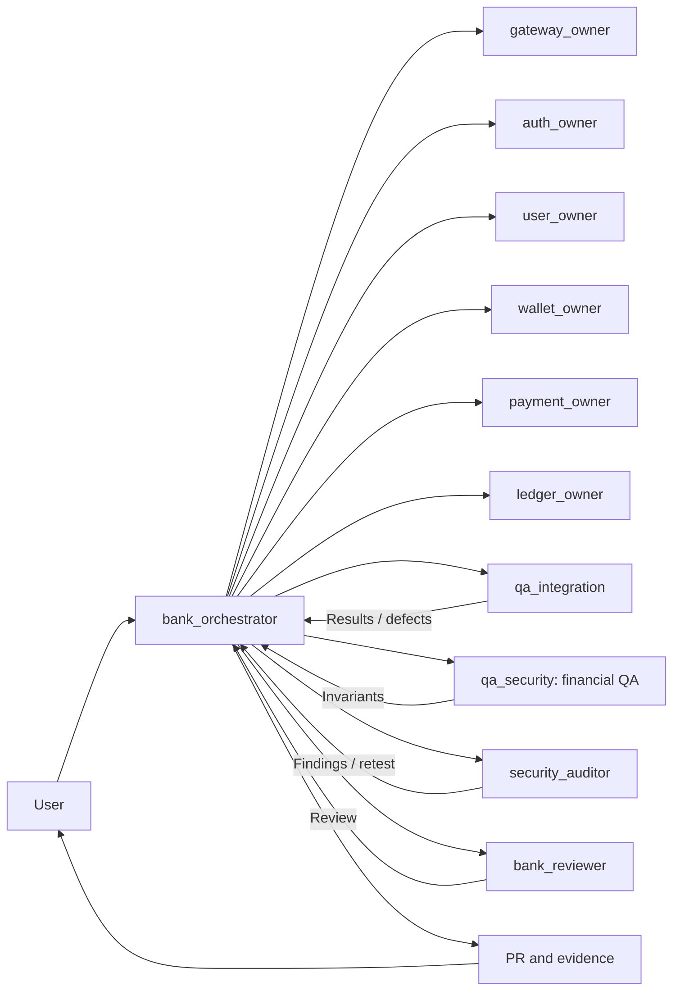

| Agent | Responsibility / writable scope |
| --- | --- |
| bank_orchestrator | Assignment, integration, shared config/runtime, Compose/CI, this documentation, PR |
| gateway_owner | app-gateway: routes, public contract, identity |
| auth_owner | auth-service: credentials, sessions, limits |
| user_owner | user-service: profiles |
| wallet_owner | wallet-service: metadata/lifecycle, durable provisioning |
| payment_owner | payment-service: planned orchestration/idempotency |
| ledger_owner | ledger-service: accounts, balances, posting correctness |
| qa_integration | End-to-end contracts, outages/recovery; only assigned test files |
| qa_security | Financial invariants and owner isolation; only assigned tests |
| security_auditor | System security, trust, secrets, dependencies, Docker/CI; independent retesting |
| bank_reviewer | Independent review of the integrated result; read-only |

Owners also maintain module tests and OpenAPI. QA/security are read-only until specific
test files are assigned. Each file has one writer; builds in a shared directory run
serially. The orchestrator manages shared Docker within the authorized task scope.

Roles: `.codex/agents`; skills: `.agents/skills`.

| Skill | Purpose |
| --- | --- |
| bank-java | Java 21, Gradle, layer boundaries, and resources |
| bank-postgres | jOOQ/HikariCP, Flyway, transactions/locks/retries |
| bank-api | OpenAPI, Javalin, identity, bounded HTTP |
| bank-testing | Spock, Testcontainers, ArchUnit, evidence |
| bank-financial-correctness | Postings, balances, concurrency, idempotency |
| bank-security | Security review and fix verification |
| bank-coordination | Assignments, messages, finding IDs, checkpoints |

Details: [skills matrix](docs/agents/skills.md), [workflow](docs/agents/workflow.md),
[team ADR](docs/adr/0006-agent-team.md). If automatic loading is unavailable, the role/skill
is read explicitly and passed into a scoped assignment; the fallback is disclosed to the user.

## Communication and remediation

Shared files do not imply shared conversation context. Saving Markdown does not notify
anyone by itself; the orchestrator forwards concrete assignments and evidence.

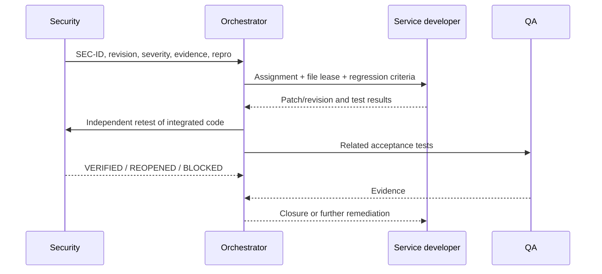

Use `send_message` for a running agent and `followup_task`, or the current client's
equivalent, for an agent that has finished. An unavailable agent is replaced with a new
one carrying the same IDs and context. On session resumption, assignments are restored
from the checkpoint and checked against source code/CI. These are orchestrator actions,
not a background task queue.

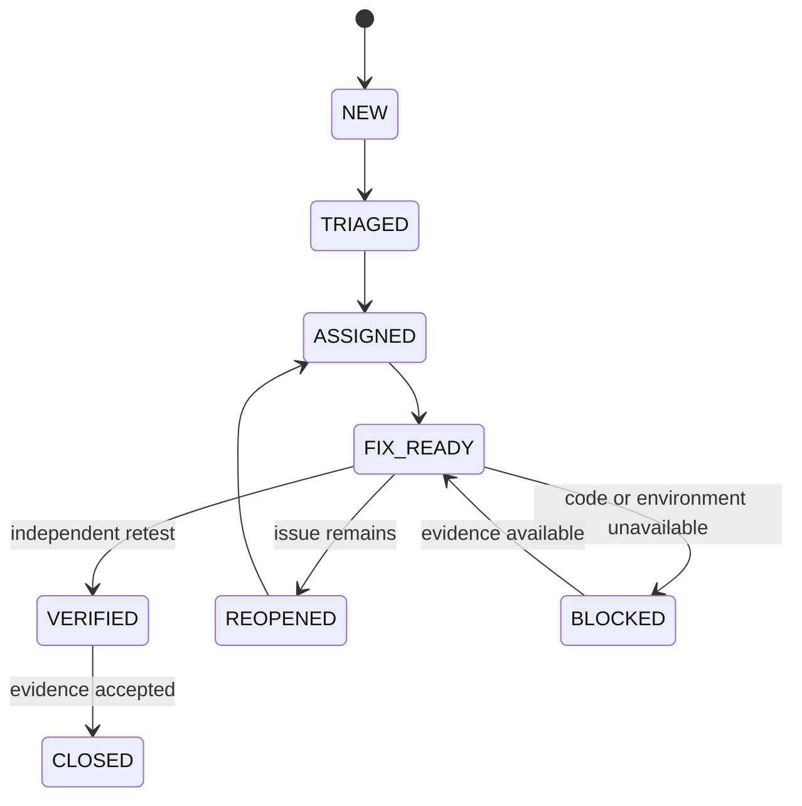

BLOCKED is possible at other stages, preserving the previous status and the reason.
False positives are closed with evidence and independent review. Confirmed unresolved
critical/high findings block PR readiness; green CI or the word "fixed" does not close
a finding. Accepting residual risk and merging are user decisions.
Records/checkpoints: [protocol](docs/agents/communication.md).

## Verification and delivery

All new PRs target `main`. The consolidated integration PR carries the completed
slices from the former bootstrap branch into main for owner review. Future feature
branches start from the latest main unless the user specifies otherwise; the
bootstrap branch is no longer the default integration target. No direct pushes
to main or automatic merges.

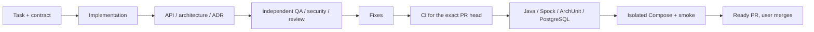

| Check | What it establishes |
| --- | --- |
| `./gradlew test` | Unit/architecture checks; excludes IntegrationSpec |
| `./gradlew check` | Also runs real PostgreSQL Testcontainers; requires Docker |
| `./gradlew installDist` | Runnable distributions |
| `scripts/smoke.py` | Readiness of six services, not business correctness |
| Auth/onboarding smoke in CI | Auth, profile, wallets through HTTP |
| Provisioning smoke in CI | Concurrent retries, ledger outage, wallet restart and unique zero-balance account mapping |
| Ledger smoke in CI | Private posting with synthetic funds |

On Windows, use `.\gradlew.bat`. CI: [.github/workflows/ci.yml](.github/workflows/ci.yml).
Fixture funding and `down --volumes` are only for disposable CI environments, never user
databases. Smoke scripts currently expect port 8080 and the `arman-bank_bank` network;
a different Compose project name alone does not provide an isolated parallel test.

## Keeping documentation current

**Document owner: bank_orchestrator.** Every change is assessed for documentation impact.
Service owners report changes to APIs, schemas, connections, invariants, and limitations
in their handoffs. The orchestrator updates this file and related documents **in the same PR**;
bank_reviewer checks them against the integrated code.

| Change | Documentation to review |
| --- | --- |
| Service / HTTP dependency | Service map, responsibilities, sequence diagrams |
| API / auth | API table, OpenAPI, trust model |
| Migration / consistency | Data, ledger flow, ADR |
| Compose / env / ports | Runtime and instructions, without secrets |
| Agent / skill / communication | Team, skills matrix, protocol, role files |
| CI / tests / readiness | Checks, limitations, M1 plan |

If documented behavior is unchanged, the PR explains why documentation is unaffected
instead of making a cosmetic date change. A substantive update records the date and
verified source revision. Planned behavior must not be presented as implemented, and
completed features must not remain only in the future section. ADRs preserve history;
a new decision gets a new ADR. The independent reviewer treats documentation drift as a defect.

This is a rule for every task and review, **not a background update while Codex is closed**.
External changes are reconciled the next time work resumes on the repository. The rule
is established in [AGENTS.md](AGENTS.md), role instructions, and the PR template.
Further reading: [README](README.md), [IDEA and manual testing](docs/onboarding.md),
[ledger](docs/ledger.md), [M1](docs/m1.md), [ADRs](docs/adr/0001-bootstrap.md).
