# Arman Bank — архитектура системы и команды агентов

> Главная карта проекта. Сверка с кодом: **2026-09-30**, исходная revision
> `63eee63d695cec0a06108c9dce74ef8a86c97ba7` в `bootstrap/m1-p2p-backend`.
> Описывает исходники, а не гарантированное состояние запущенных контейнеров.

## Навигация

1. [Готовность и стек](#готовность-и-стек)
2. [Сервисы и runtime](#сервисы-и-runtime)
3. [API и авторизация](#api-и-авторизация)
4. [Данные и ledger](#данные-и-ledger)
5. [Будущий P2P](#будущий-p2p)
6. [Команда агентов](#команда-агентов)
7. [Коммуникация и исправления](#коммуникация-и-исправления)
8. [Проверки и доставка](#проверки-и-доставка)
9. [Поддержание актуальности](#поддержание-актуальности)

## Готовность и стек

Учебный banking backend для обсуждения инженерных решений на интервью.
**M1 — первый функциональный milestone, пока не завершён:** публичные P2P должны
корректно работать при повторах, конкуренции и сбоях. Private ledger сам по себе
не завершает M1. Проект не заявляет соответствие внутренней архитектуре Revolut.

| Область | Сейчас | Дальше |
| --- | --- | --- |
| Auth | Register/login/me/logout, непрозрачные сессии | Production identity controls, MFA, подтверждение email |
| User | Профиль текущей identity | Развитие по требованиям |
| Wallet | Метаданные owner/currency, ACTIVE/CLOSED | Надёжное создание ledger account |
| Ledger | Приватные счета, балансы, атомарные проводки, устойчивые результаты | Интеграция с wallet/payment |
| Payment | Схема и operational endpoints | P2P orchestration и PENDING recovery |
| Gateway | Auth, профиль, кошельки | Публичные P2P endpoints |

Java 21, Gradle multi-project, Javalin, PostgreSQL, Flyway, jOOQ, HikariCP;
Spock, Testcontainers, ArchUnit; REST/OpenAPI; Docker Compose, GitHub Actions.
Точные версии: [build.gradle](build.gradle), [runtime build](platform-runtime/build.gradle),
[Gradle wrapper](gradle/wrapper/gradle-wrapper.properties), [Compose](compose.yaml).
Spring, Kafka, Redis, Kubernetes и iOS сейчас не реализованы.

## Сервисы и runtime

**Только действующие HTTP-связи.** У ledger пока нет прикладного клиента в других
сервисах. Payment не вызывает ledger, wallet ещё не создаёт ledger accounts.

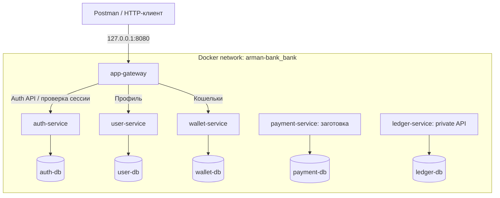

| Модуль | Ответственность | Граница |
| --- | --- | --- |
| app-gateway | Внешние маршруты, session validation, очистка заголовков | Нет БД и финансовой логики |
| auth-service | Credentials, сессии, limits | Не владеет профилем |
| user-service | Профиль auth identity | Не выдаёт токены |
| wallet-service | Владелец, валюта, lifecycle | Не источник баланса |
| payment-service | Будущий процесс перевода/client idempotency | Бизнес-операции ещё не реализованы |
| ledger-service | Счета, балансы, неизменяемые парные проводки | Нет публичного funding API |
| platform-runtime | HTTP lifecycle, DB wiring, migrations, health | Библиотека, не отдельный сервис; без общих бизнес-сущностей |

### Границы кода

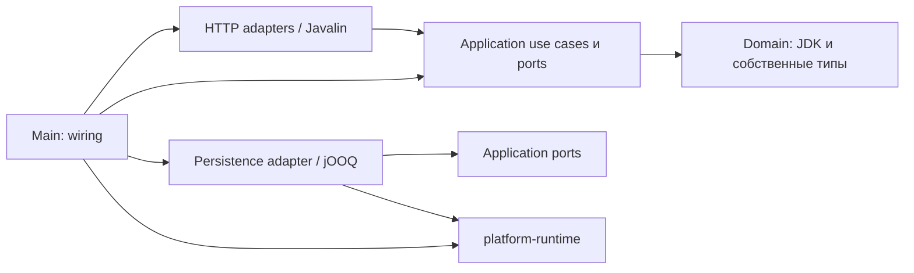

Это правило организации use cases, а не обещание наличия всех слоёв в каждой
заготовке. Порты вводятся для реальных зависимостей. Сервисы не импортируют Java-код
друг друга и не читают чужие базы. ArchUnit проверяет архитектурные ограничения.

### Контейнеры и локальная среда

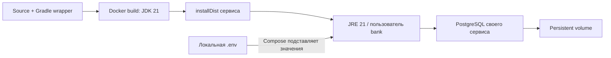

Внутри Compose сервисы слушают 8080, PostgreSQL — 5432. Базовый Compose публикует
только gateway на loopback; пять БД имеют отдельные volumes. Flyway выполняется
при создании DB wiring до открытия HTTP listener. Ошибка миграции блокирует старт.

Переменные: `PORT`, `DB_URL`, `DB_USER`, `DB_PASSWORD`; у защищённых внутренних API —
`INTERNAL_AUTH_KEY`; у gateway — `AUTH_BASE_URL`, `USER_BASE_URL`, `WALLET_BASE_URL`.
Секреты берутся из локальной конфигурации, в документацию их значения не попадают.
Обычный запуск Java **не читает `.env` автоматически**: в IDEA нужно настроить
environment variables/env-файл; Compose использует свой механизм подстановки.

Локальный пользовательский `compose.override.yaml` открывает DataGrip на
`127.0.0.1`: auth **5433**, user **5434**, wallet **5435**, payment **5436**, ledger
**5437**. Это не часть гарантированной конфигурации нового clone — сверяйте свой
override. Во всех контейнерах БД и пользователь называются `bank`; пароль локальный.
Перезапуск не требует удаления volumes. См. [README](README.md) и [IDEA](docs/onboarding.md).

## API и авторизация

Контракты находятся в `src/main/resources/openapi.yaml` каждого сервиса.
`/openapi.yaml` отдаёт YAML, не Swagger UI. `/` не является пользовательским UI.

| Доступ | Метод и путь | Назначение |
| --- | --- | --- |
| Gateway | POST `/v1/auth/register`, POST `/v1/auth/login` | Регистрация / сессия |
| Gateway + Bearer | GET `/v1/auth/me`, POST `/v1/auth/logout` | Identity / отзыв |
| Gateway + Bearer | GET / PUT `/v1/users/me` | Свой профиль |
| Gateway + Bearer | GET / POST `/v1/wallets` | Свои кошельки |
| Private ledger | POST `/v1/ledger/accounts`, GET `/v1/ledger/accounts/{id}` | Счёт и баланс |
| Private ledger | POST `/v1/ledger/transfers`, GET `/v1/ledger/transfers/{id}` | Проводка/replay и результат |
| Каждый сервис | GET `/health/live`, `/health/ready`, `/openapi.yaml` | Operational endpoints |

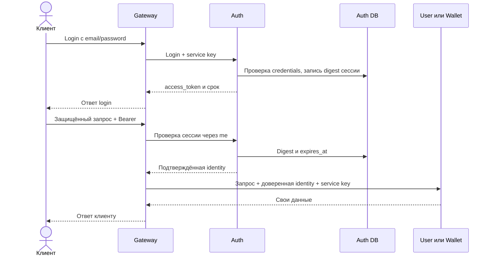

Пароли защищены Argon2id. Токен — случайная непрозрачная строка, не JWT; в `sessions`
хранится SHA-256 digest. Срок — 30 минут, logout удаляет сессию. Gateway проверяет
каждый profile/wallet запрос через auth, заменяет клиентскую identity доверенной
и не передаёт bearer token в user/wallet. Ошибка авторизации блокирует запрос.

Ledger требует `X-Service-Key` и доверенный `X-Identity-Id`, gateway его не проксирует.
Общий service key не изолирует скомпрометированные сервисы друг от друга.
Readiness persistent-сервиса проверяет только его БД; readiness gateway — только
сам gateway. `UP` не доказывает доступность downstream или корректность P2P.

## Данные и ledger

Межсервисные UUID — **логические ссылки**, не cross-database foreign keys.
`owner_id` означает auth identity UUID, а не ID профиля.

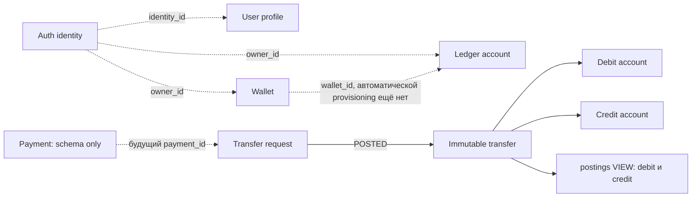

| База | Таблицы / гарантии |
| --- | --- |
| auth-db | `identities`: unique email, password_hash; `sessions`: token_hash PK, FK identity_id, expires_at; `auth_attempts`: persistent limits |
| user-db | `profiles`: unique identity_id, display_name |
| wallet-db | `wallets`: unique(owner_id,currency), EUR/USD/GBP, ACTIVE/CLOSED; без баланса |
| payment-db | `payments`: unique(requester_id,idempotency_key), request_hash, wallet IDs, amount/currency, PENDING/COMPLETED/REJECTED; только схема |
| ledger-db | `accounts`: unique wallet_id, owner, CUSTOMER/CLEARING, balance_minor; `transfers`: payment_id PK и FK счетов/валюты; `transfer_requests`: durable payload/outcome; `postings`: представление |
| Каждая БД | `flyway_schema_history`: технический журнал применённых миграций |

Accounts в transfer_requests не обязаны существовать: эта таблица сохраняет и
отказы. `accounts.wallet_id` пока не проверяется HTTP-запросом в wallet-service.
Точные колонки/индексы/constraints — в миграциях сервисов; опубликованные миграции
append-only. У текущего DB owner есть административные возможности: триггеры не
являются защитой от администратора. Ограниченный runtime DB role — будущая работа.

### Атомарная проводка — реализовано

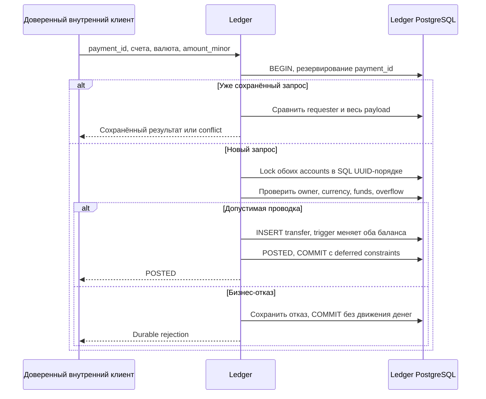

Деньги — целые minor units и валюта: для EUR/USD/GBP `100` = одна единица.
Сумма положительная, CUSTOMER balance неотрицательный, overflow запрещён.
Одна immutable transfer даёт две противоположные записи в postings view.
Проводка, балансы и terminal result фиксируются одной PostgreSQL-транзакцией.
Deferred constraints не разрешают commit незавершённого PENDING.

Повтор использует тот же `payment_id`, requester и payload; изменённый запрос даёт
conflict. Durable insufficient-funds остаётся отказом даже после последующего
пополнения. После timeout повторяется/ищется **тот же ID**: отсутствие ответа не
означает rollback. Ошибка транзакции откатывает её изменения.
POST: 200 POSTED, 409 rejection/conflict; GET результата: 200 даже для сохранённого
отказа, 404 для отсутствующего/чужого результата. Счета открываются с нулём.
Funding API нет; CLEARING fixtures используются только в изолированных тестах.
Подробности: [ledger](docs/ledger.md), [ADR 0005](docs/adr/0005-atomic-ledger.md).

## Будущий P2P

**План, не реализованный поток.** Пунктирные связи предстоит построить.

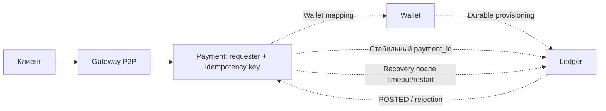

Сначала wallet→ledger provisioning и её recovery; затем payment orchestration и
reconciliation; затем публичный P2P с полными acceptance tests. `ACTIVE` wallet
сейчас не подтверждает ledger readiness. Общей распределённой транзакции нет:
нужны сохранённое состояние и идемпотентные команды, не обещание exactly-once HTTP.
См. [M1](docs/m1.md), [миссию provisioning](docs/agents/missions/wallet-ledger.md).

## Команда агентов

Агенты запускаются под задачу внутри Codex; это не контейнеры банка и не постоянные
фоновые процессы. Главный чат — оркестратор. До трёх workers одновременно,
остальные роли запускаются волнами; используются только нужные для задачи роли.
Модели/разрешения наследуются от сессии, инструкции не являются security sandbox.

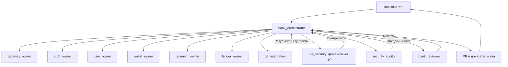

| Агент | Ответственность / writable scope |
| --- | --- |
| bank_orchestrator | Распределение, интеграция, shared config/runtime, Compose/CI, эта документация, PR |
| gateway_owner | app-gateway: маршруты, публичный контракт, identity |
| auth_owner | auth-service: credentials, сессии, limits |
| user_owner | user-service: профили |
| wallet_owner | wallet-service: metadata/lifecycle, будущая provisioning |
| payment_owner | payment-service: будущая orchestration/idempotency |
| ledger_owner | ledger-service: accounts, balances, posting correctness |
| qa_integration | Сквозные контракты, outages/recovery; только выделенные тестовые файлы |
| qa_security | Финансовые инварианты и owner isolation; только выделенные тесты |
| security_auditor | Системная безопасность, trust, secrets, dependencies, Docker/CI; независимая перепроверка |
| bank_reviewer | Независимый review интегрированного результата; read-only |

Владельцы также отвечают за module tests и OpenAPI. QA/security read-only, пока не
выделены конкретные тестовые файлы. Один файл — один writer; builds общей папки
сериализованы. Shared Docker управляет оркестратор в рамках разрешённой задачи.

Роли: `.codex/agents`; skills: `.agents/skills`.

| Skill | Назначение |
| --- | --- |
| bank-java | Java 21, Gradle, границы слоёв и ресурсы |
| bank-postgres | jOOQ/HikariCP, Flyway, transactions/locks/retries |
| bank-api | OpenAPI, Javalin, identity, bounded HTTP |
| bank-testing | Spock, Testcontainers, ArchUnit, доказательства |
| bank-financial-correctness | Проводки, остатки, конкуренция, идемпотентность |
| bank-security | Security review и подтверждение исправлений |
| bank-coordination | Assignments, сообщения, finding IDs, checkpoints |

Подробности: [матрица skills](docs/agents/skills.md), [workflow](docs/agents/workflow.md),
[ADR команды](docs/adr/0006-agent-team.md). При отсутствии автоматической загрузки
роль/skill читается явно и передаётся в scoped assignment; fallback сообщается пользователю.

## Коммуникация и исправления

Общие файлы не означают общий контекст разговоров. Сохранённый Markdown сам по
себе никого не уведомляет; оркестратор пересылает конкретные задания и evidence.

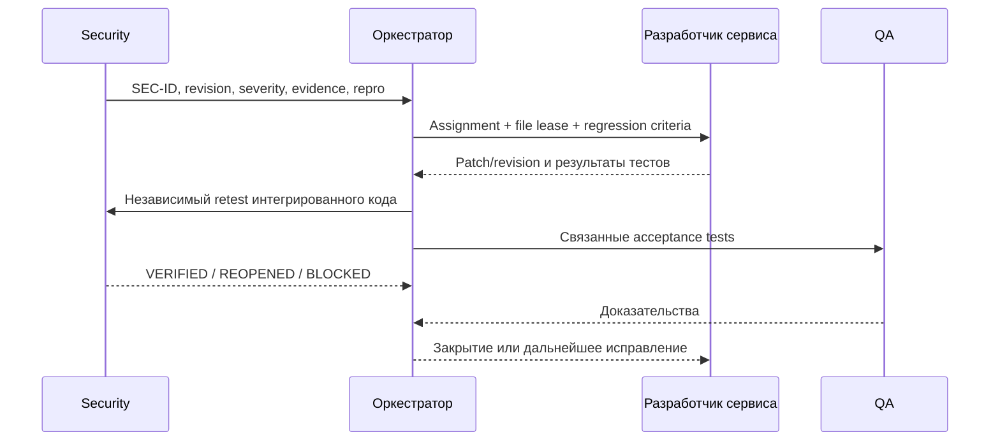

Работающему агенту — `send_message`; завершившему — `followup_task` или эквивалент
текущего клиента. Недоступный агент заменяется новым с теми же ID и контекстом.
При возобновлении сессии assignments восстанавливаются из checkpoint и сверяются
с исходниками/CI. Это действия оркестратора, не фоновая очередь задач.

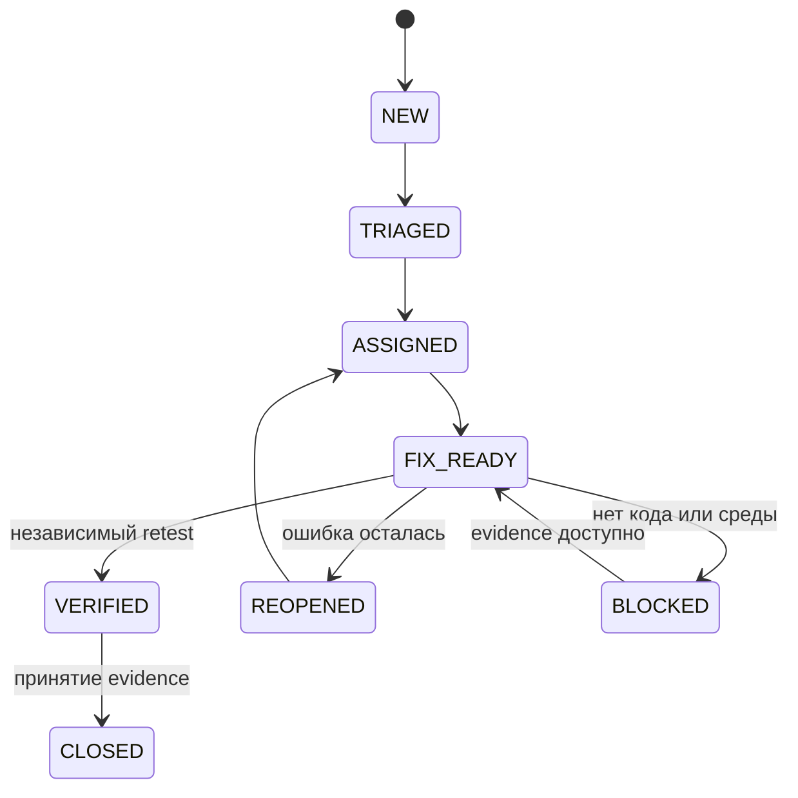

BLOCKED возможен на других этапах с сохранением предыдущего статуса и причины.
False positive закрывается с доказательствами и независимым review.
Подтверждённые незакрытые critical/high блокируют готовность PR; зелёный CI или
слово «fixed» не закрывают находку. Принятие остаточного риска и merge — решения
пользователя. Record/checkpoint: [протокол](docs/agents/communication.md).

## Проверки и доставка

```mermaid
flowchart LR
    T["Задача + контракт"] --> DEV["Реализация"]
    DEV --> DOC["API / архитектура / ADR"]
    DOC --> REV["Независимые QA / security / review"]
    REV --> FIX["Исправления"]
    FIX --> CI["CI точного PR head"]
    CI --> TEST["Java / Spock / ArchUnit / PostgreSQL"]
    TEST --> SMOKE["Изолированный Compose + smoke"]
    SMOKE --> READY["Готовый PR, merge пользователем"]
```

| Проверка | Что доказывает |
| --- | --- |
| `./gradlew test` | Unit/architecture; исключает IntegrationSpec |
| `./gradlew check` | Также реальные PostgreSQL Testcontainers; нужен Docker |
| `./gradlew installDist` | Запускаемые distributions |
| `scripts/smoke.py` | Readiness шести сервисов, не бизнес-корректность |
| auth/onboarding smoke в CI | Auth, профиль, кошельки через HTTP |
| ledger-smoke в CI | Приватная проводка с синтетическими средствами |

На Windows используйте `.\gradlew.bat`. CI: [.github/workflows/ci.yml](.github/workflows/ci.yml).
Fixture funding и `down --volumes` — только для одноразового CI, не пользовательских
БД. Smoke scripts пока ожидают порт 8080 и сеть `arman-bank_bank`; другого Compose
project name недостаточно для изолированного параллельного теста.

## Поддержание актуальности

**Владелец документа — bank_orchestrator.** Каждое изменение проходит проверку
влияния на документацию. Владельцы сервисов передают изменения API, схем, связей,
инвариантов и ограничений в handoff. Оркестратор обновляет этот файл и связанные
документы **в том же PR**; bank_reviewer сверяет их с интегрированным кодом.

| Что изменилось | Что пересматривается |
| --- | --- |
| Сервис / HTTP dependency | Карта сервисов, ответственность, sequence diagrams |
| API / auth | Таблица API, OpenAPI, модель доверия |
| Миграция / consistency | Данные, ledger flow, ADR |
| Compose / env / ports | Runtime и инструкции, без секретов |
| Агент / skill / коммуникация | Команда, skills matrix, протокол, role files |
| CI / тесты / готовность | Проверки, ограничения, план M1 |

Если описанное поведение не изменилось, PR содержит объяснение «документация не
затронута» вместо косметической смены даты. При содержательном обновлении указываются
дата и проверенная исходная revision. План нельзя изображать реализацией, а готовую
функцию оставлять только в разделе «будущее». ADR сохраняют историю; новое решение
оформляется новым ADR. Независимый reviewer считает расхождение документации дефектом.

Это правило каждой задачи и review, **не фоновое обновление при закрытом Codex**.
Внешние изменения сверяются при следующей работе с репозиторием. Правило закреплено
в [AGENTS.md](AGENTS.md), role instructions и PR template.
Дополнительно: [README](README.md), [IDEA и ручные тесты](docs/onboarding.md),
[ledger](docs/ledger.md), [M1](docs/m1.md), [ADRs](docs/adr/0001-bootstrap.md).
