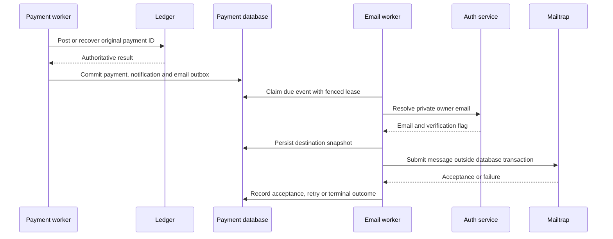

# Transactional email notifications

Payment-service owns the email outbox and its background dispatcher. A terminal
payment, in-app notification and email event commit together. Mailtrap outages
cannot turn a completed transfer into a rejection or remove its in-app message.



## Events and recipients

| Event | Recipient |
| --- | --- |
| PAYMENT_COMPLETED | Sender |
| PAYMENT_RECEIVED | Recipient of a completed transfer |
| PAYMENT_REJECTED | Sender only |

Messages contain the event, payment ID and exact AED amount. They do not expose the
counterparty's email or full phone number. Only newly completed/rejected payments
enqueue email; migration does not email historical transactions. Existing in-app
notification APIs and mobile screens are unchanged.

## Configure Mailtrap

Keep credentials in your ignored local `.env`, never in source, screenshots or
logs. The only service receiving the Mailtrap token is payment-service.

```dotenv
EMAIL_DELIVERY_ENABLED=true
MAILTRAP_MODE=sandbox
MAILTRAP_API_TOKEN=<Mailtrap API token>
MAILTRAP_INBOX_ID=<numeric Sandbox inbox ID>
MAILTRAP_FROM_EMAIL=notifications@example.com
MAILTRAP_FROM_NAME=ArMoney
```

Sandbox captures mail in Mailtrap rather than delivering it to recipients. Obtain
the token and inbox ID from your Sandbox API integration page. For real delivery,
use `MAILTRAP_MODE=sending`, an Email Sending API token and an approved sender on a
Mailtrap-verified sending domain. The inbox ID is then unused. No arbitrary provider
endpoint or TLS bypass is configurable. See the official
[Mailtrap API documentation](https://docs.mailtrap.io/developers).

Compose sets `AUTH_BASE_URL=http://auth-service:8080`. For a local IDEA launch,
configure the auth origin and internal service key alongside the payment database.
Deploy auth-service before enabling the dispatcher. Recreate payment-service with
the same complete Compose file list used by your installation to load changed
environment variables; a container restart alone does not update its environment.

With delivery disabled, events remain queued. Enabling delivery can send that
backlog, including events created while credentials were unavailable. Inspect it
before switching from Sandbox to real Sending. Do not clear financial records or
modify terminal payment states to retry an email.

## Contact trust

The private auth endpoint `/v1/internal/identities/{id}/email` requires the internal
service key and is not exposed through gateway. Local password registration emails
are unverified. For SSO, validated introspection refreshes a separate email contact
and its verification flag; it does not change login credentials or link accounts.
Missing claims clear stale provider contact on the next successful exchange.
Existing SSO users need to sign in again before a contact can be captured.

Sandbox can use an unverified address because it does not deliver to it. Real
Sending skips unverified or missing addresses. Email verification enrolment is
not implemented here; do not fabricate verification to enable real delivery.
Provider contact changes are observed at SSO exchange, not continuously. A selected
destination is frozen for retries; operators must account for that snapshot when
handling address revocation and delayed delivery.

## Reliability and operational limits

Network calls never hold a payment database transaction. Expired leases allow
recovery after restart; stale workers cannot acknowledge another worker's claim.
Transient errors use bounded backoff. Permanent failures and exhausted attempts
remain inspectable rather than disappearing. Stored error codes contain no provider
body, token or full recipient address.

A successful provider response records acceptance, not proof that the user's
mailbox received the email. A lost response or process crash after provider
acceptance can cause duplicate emails on retry. Event uniqueness prevents duplicate
outbox rows but cannot provide exactly-once delivery across PostgreSQL and Mailtrap.
There are no delivery webhooks, bounce processing or automatic retention in this
slice. Never run financial funding fixtures against a persistent installation.

Inspect delivery status in payment-db without listing recipient addresses:

```sql
SELECT status, error_code, count(*)
FROM email_outbox
GROUP BY status, error_code
ORDER BY status, error_code;

SELECT count(*) AS due_events, min(created_at) AS oldest_event
FROM email_outbox
WHERE status = 'PENDING' AND next_attempt_at <= clock_timestamp();
```

`SENT` means provider acceptance; `SKIPPED` records an ineligible recipient;
`DEAD` records a permanent error or exhausted retries. The dispatcher does not
silently requeue terminal rows. Correct configuration/contact failures before
considering an operator-reviewed replay, and consider possible prior acceptance.
There is no public retry/admin API. Do not print outbox rows containing addresses
into logs or issue descriptions. A row's delivery mode is pinned when first claimed;
switching configuration must not turn an existing Sandbox retry into real mail.
