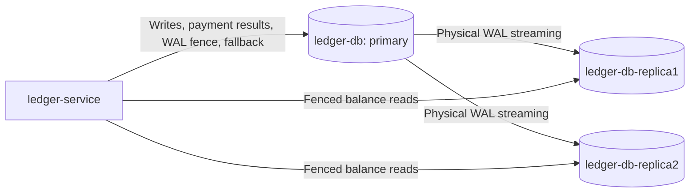

# Ledger replication operations

The optional `compose.ledger-replication.yaml` keeps the existing primary
`ledger-db` and its volume and adds `ledger-db-replica1` and `ledger-db-replica2`
with independent new volumes. Both receive WAL directly from primary. Base Compose
remains single-node. [ADR 0013](adr/0013-ledger-replication.md) records consistency
and availability tradeoffs. This guide is source configuration, not proof that
the persistent stack has been upgraded.



## Activate without replacing existing data

Back up the ledger first and schedule a write-maintenance window. Preserve existing
passwords, project name and volumes. Add a distinct random
`LEDGER_REPLICATION_PASSWORD` to the ignored local `.env`; never commit its value
or include carriage returns/newlines in it.
Use the same explicit Compose file list for every command, including SSO or other optional
files already used by the installation. The commands below show the base plus
replication file set; add existing optional files consistently.

```powershell
docker compose -f compose.yaml -f compose.ledger-replication.yaml stop payment-service wallet-service ledger-service
docker compose -f compose.yaml -f compose.ledger-replication.yaml up -d ledger-db
docker compose -f compose.yaml -f compose.ledger-replication.yaml up -d ledger-replication-setup ledger-db-replica1 ledger-db-replica2
docker compose -f compose.yaml -f compose.ledger-replication.yaml exec -T ledger-db psql -U bank -d bank -c "SELECT application_name,state,sync_state,flush_lsn,replay_lsn FROM pg_stat_replication;"
```

Wait for two streaming replicas with quorum status before starting applications:

```powershell
docker compose -f compose.yaml -f compose.ledger-replication.yaml up --build -d ledger-service wallet-service payment-service
```

The one-shot setup is designed for existing and fresh primary volumes. It creates
a dedicated non-superuser replication role, two physical slots and synchronous
quorum configuration. Both slots reserve WAL immediately, before concurrent base
backups can recycle needed segments. Only inactive never-reserved slots under the
two overlay-owned names receive guarded repair; active or unusable slots are not
silently discarded. Its local-commit setting applies only to administrative
bootstrap. Standbys bootstrap only empty data directories, refuse partial or
promoted directories and never automatically delete/reseed data. An interrupted
clone requires operator inspection and explicit recreation of only the affected
standby after confirming which volume it uses.

## Reads and availability

`LEDGER_READ_DB_URLS` is a comma-separated list of standby JDBC URLs. It uses
`DB_USER`/`DB_PASSWORD`; empty means all reads use primary. Standby pools do not run
Flyway. The router checks database name, cluster system identifier and timeline,
requires a streaming WAL receiver with the primary's active timeline and standby
recovery mode, and waits up to 250 ms for replay of a primary WAL
flush fence. It rechecks identity/recovery after the query and otherwise reads
primary. Pool acquisition, statements and sockets have separate bounded timeouts;
250 ms is not an end-to-end response SLA.

Provisioning, posting, idempotency checks and result lookup always use primary.
The overlay sets `LEDGER_REQUIRE_SYNC_CONFIRMATION=true`: returning provisioning
or a new/replayed payment result also requires durable WAL confirmation on a
quorum standby after the primary transaction. Missing confirmation produces an
unavailable response, preserving the original command for recovery. This gate
has no primary-only success fallback. It protects cancellation/restart recovery,
where a locally committed transaction can outlive its synchronous wait and a
read-only or conflict-only retry would not wait automatically.
Base Compose omits this flag and retains its existing single-node durability model.
Readiness requires a usable primary that is not in recovery. Replica outage can
degrade to primary reads; it cannot manufacture a balance or financial success.
The bootstrap `bank` role remains the existing schema-owning local role. Restricted
production roles need explicitly scoped access to the control functions used for
identity checks and replication/receiver statistics. Missing read-routing permission
falls back to primary; missing durability-confirmation permission fails closed.
The confirmation gate has a two-second retry budget with separate connection/query
timeouts, requires a named quorum sender and the matching configured standby, and
checks durable WAL receipt as well as cluster/database/active timeline identity.

`synchronous_commit=on` waits for WAL flush on at least one quorum standby.
With both disconnected, a commit can wait even though its local effects exist.
A client timeout is not proof of rollback: query the authoritative result or retry
the original payment ID. Never create a replacement transfer to escape uncertainty.

## Monitor and recover

Inspect `pg_stat_replication` for streaming/quorum state and WAL positions, and
`pg_replication_slots` for `active`, `wal_status`, `restart_lsn` and retained WAL.
`max_slot_wal_keep_size=1GB` bounds slot retention at checkpoints; it is not a hard
limit on total disk usage. A replica beyond retained WAL may need a new base backup.
Retain independent backups and test restore; replication also copies accidental
changes and is not a backup. No database ports are published by this overlay.
Replication uses SCRAM authentication on the private Docker network; database-node
TLS is not configured by this development deployment.

## Manual failover

There is no automatic HA manager or constant write proxy. Promotion alone does
not restore application availability. Do not select replica1 merely by its name:
with ANY 1, replica2 may hold a more recent acknowledged commit.

1. Stop application writes and fence the old primary so it cannot accept writes,
   including after a restart. A failed health probe is insufficient fencing.
2. Compare available replicas' received/replayed WAL and timeline. Obtain the
   replica containing acknowledged commits; if this cannot be established, do not
   promise zero data loss. Apply all available WAL before promotion.
3. On that replica, call `SELECT pg_promote();` with administrative privileges and
   verify `SELECT pg_is_in_recovery();` returns false.
4. Explicitly configure the promoted container to start as primary. The shipped
   standby entrypoint deliberately refuses a promoted volume on restart. Preserve
   its volume; replace that entrypoint with the official PostgreSQL entrypoint in
   an operator-reviewed recovery override. Stop the old setup service from targeting
   the old primary.
5. Reconfigure the remaining standby's upstream and physical slot on the new
   primary. Restore the quorum configuration and verify a synchronous standby is
   streaming before allowing application writes. Never turn off sync to mask an
   incomplete recovery.
6. Change ledger `DB_URL` and standby URLs with a recovery override and recreate
   ledger-service to reset pools and pinned identity/timeline. Resume payment and
   wallet services; recover pending commands with their original identifiers.
7. Rejoin the fenced former primary only after suitable `pg_rewind` or a new base
   backup. Never simply restart it as a second writable primary.

This is a manual recovery checklist, not a turnkey failover script or a measured
10–30 second recovery guarantee. Multi-host HA, automatic election/fencing and
reparenting require a separate tested operational design.

## Disposable verification

```powershell
.\gradlew.bat check
python scripts/ledger-replication-smoke.py
```

The smoke creates its own random Compose project, credentials, private network and
volumes, uses no local `.env`/override/host ports, and removes only that project.
It tests direct streaming, read-only replicas, quorum interruption/recovery,
primary restart and manual promotion/reparenting with a synchronous write using a generic isolated
table. Real ledger financial invariants and read routing are tested separately by
PostgreSQL Testcontainers. No fixture touches or funds the persistent stack.
